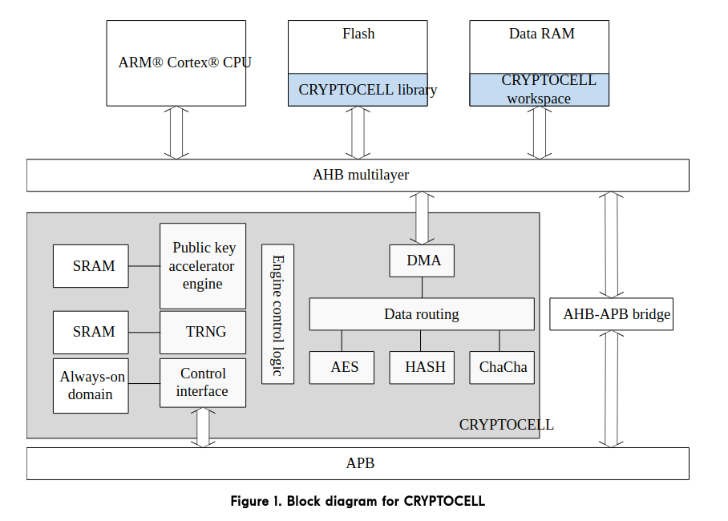
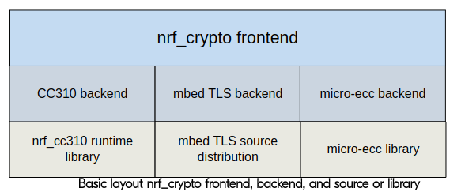

# CryptCell 310ソフトウェアスタック解析

## CryptoCell 310



ｎRF52840のProduct Specificationによると、CryptoCell 310は、複数の暗号化アクセラレータを内包するペリフェラルデバイスになっています。
このデバイスの機能を使う場合、CryptCell library経由で処理を依頼します。

ソフトウェアスタックは、大まかには次のようになっています。



`nrf_crypto`というフロントエンドAPIがあり、後は、複数のbackendから1つを選ぶことができます。
今回興味があるのは、cc310 backendです。

`|> nRF5_SDK/components/libraries/crypto`が該当しそうです。

```
$ tree -L 2
.
├── backend
│   ├── cc310
│   ├── cc310_bl
│   ├── cifra
│   ├── mbedtls
│   ├── micro_ecc
│   ├── nrf_hw
│   ├── nrf_sw
│   └── oberon
├── nrf_crypto_aead_backend.h
├── nrf_crypto_aead.c
├── nrf_crypto_aead.h
├── nrf_crypto_aead_shared.h
├── nrf_crypto_aes_backend.h
├── nrf_crypto_aes.c
├── nrf_crypto_aes.h
├── nrf_crypto_aes_shared.c
├── nrf_crypto_aes_shared.h
├── nrf_crypto_ecc_backend.h
├── nrf_crypto_ecc.c
├── nrf_crypto_ecc.h
├── nrf_crypto_ecc_shared.h
├── nrf_crypto_ecdh_backend.h
...
```

トップレベルにある`*.c`ファイルがフロントエンドに該当します。
さらに、backendディレクトリ配下に、それぞれのbackendの実装があります。

## rng example

コードが短いので、手始めに`\> nRF5_SDK_15.2.0_9412b96/examples/crypto/nrf_crypto/rng`を解析する。

まずは、includeしているファイルを確認します。今回、重要そうなのは、`nrf_crypto.h`くらいです。

```c
#include <stdbool.h>
#include <stdint.h>
#include "boards.h"
#include "nrf_log_default_backends.h"
#include "nrf_log.h"
#include "nrf_log_ctrl.h"
#include "nrf_crypto.h"
```

コード全体は、以下の通りです。CryptoCellの処理だけを抽出して見ていきます。

```c
int main(void)
{
    ret_code_t ret_val;

    log_init();

    NRF_LOG_INFO("RNG example started.");

    ret_val = nrf_crypto_init();
    APP_ERROR_CHECK(ret_val);

    // The RNG module is not explicitly initialized in this example, as
    // NRF_CRYPTO_RNG_AUTO_INIT_ENABLED and NRF_CRYPTO_RNG_STATIC_MEMORY_BUFFERS_ENABLED
    // are enabled in sdk_config.h.

    NRF_LOG_INFO("Generate %u random vectors of length %u:", ITERATIONS, VECTOR_LENGTH);
    for (int i = 0; i < ITERATIONS; i++)
    {
        ret_val = nrf_crypto_rng_vector_generate(m_random_vector, VECTOR_LENGTH);
        APP_ERROR_CHECK(ret_val);
        NRF_LOG_HEXDUMP_INFO(m_random_vector, VECTOR_LENGTH)
    }

// 乱数の範囲を指定するサンプルなので、省略します。
...

    NRF_LOG_INFO("RNG example executed successfully.");

    for (;;)
    {
    }
}
```

### nrf_crypto_init

まずは初期化からです。

`|> components/libraries/crypto/nrf_crypto_init.h`

```c
/**@brief Function for initializing nrf_crypto and all registered backends.
 *
 * @details Must always be called before any other @ref nrf_crypto function.
 *
 * @retval  NRF_SUCCESS         The initialization was successful.
 * @retval  NRF_ERROR_INTERNAL  An internal error occured in the nrf_crypt backend init.
 */
ret_code_t nrf_crypto_init(void);
```

backendは複数登録できて、登録したbackendを全て初期化する関数です。
backendを登録するマクロが、同ヘッダ内にあります。

```c
/**@internal @brief  Macro for registering a nrf_crypto backend for initialization by using
 *                   nrf_section.
 *
 * @details     This macro places a variable in a section named "crypto_data", which
 *              is initialized by @ref nrf_crypto_init.
 *
 * @note    This macro is used internally based on sdk_config.h configurations for nrf_crypto
 */
#define CRYPTO_BACKEND_REGISTER(crypto_var) NRF_SECTION_ITEM_REGISTER(crypto_data, crypto_var)
```

cc310 backendの実装を見ると、`CRYPTO_BACKEND_REGISTER`マクロで`init_fn`と`uninit_fn`を登録しています。

`|> components/libraries/crypto/backend/cc310/cc310_backend_init.c`

```c
CRYPTO_BACKEND_REGISTER(nrf_crypto_backend_info_t const cc310_backend) =
{
    .init_fn    = cc310_backend_init,
    .uninit_fn  = cc310_backend_uninit,
};
```

`CRYPTO_BACKEND_REGISTER`マクロのコメントから、この関数ポインタを、`crypto_data`というsection内に配置するみたいですね。

だいぶ横道にそれましたが、`nrf_crypto_init()`の中身を見ていきます。

`|> components/libraries/crypto/nrf_crypto_init.c`

```c
ret_code_t nrf_crypto_init(void)
{
    ret_code_t      ret_val;
    size_t const    num_backends = NRF_CRYPTO_BACKEND_SECTION_ITEM_COUNT;

    m_state = INITIALIZING;

    // Iterate through each backends to call the init function
    for (size_t i = 0; i < num_backends; i++)
    {
        nrf_crypto_backend_info_t const * p_backend = NRF_CRYPTO_BACKEND_SECTION_ITEM_GET(i);
        ret_val = p_backend->init_fn();
        if (ret_val != NRF_SUCCESS)
        {
            return ret_val;
        }
    }

    // Set nrf_crypto to initialized
    m_state = INITIALIZED;
    return NRF_SUCCESS;
}
```

ちょっとずつ見ていきます。

```c
    size_t const    num_backends = NRF_CRYPTO_BACKEND_SECTION_ITEM_COUNT;
```

`NRF_CRYPTO_BACKEND_SECTION_ITEM_COUNT`は、`crypto_data`セクションを解析して、backendがいくつ登録されているか、を計算します。

```c
#define NRF_CRYPTO_BACKEND_SECTION_ITEM_COUNT       NRF_SECTION_ITEM_COUNT(crypto_data, nrf_crypto_backend_info_t)
```

次に、登録されているbackendの個数がわかると、backendnの初期化を行います。

```c
    // Iterate through each backends to call the init function
    for (size_t i = 0; i < num_backends; i++)
    {
        nrf_crypto_backend_info_t const * p_backend = NRF_CRYPTO_BACKEND_SECTION_ITEM_GET(i);
        ret_val = p_backend->init_fn();
        if (ret_val != NRF_SUCCESS)
        {
            return ret_val;
        }
    }
```

sectionから、`NRF_CRYPTO_BACKEND_SECTION_ITEM_GET(i)`を使って、`nrf_crypto_backend_info_t`を1つずつ取得します。

```c
#define NRF_CRYPTO_BACKEND_SECTION_ITEM_GET(i)      NRF_SECTION_ITEM_GET(crypto_data, nrf_crypto_backend_info_t, (i))
```

`nrf_crypto_backend_info_t`には、`init_fn()`が登録されているので、各backendの初期化関数を呼び出します。
cc310 backendのinit_fn()実装を見てみましょう。

```c
static ret_code_t cc310_backend_init(void)
{
    uint32_t    ret_val;
    CRYSError_t crys_error;

    cc310_backend_mutex_init();

    // Enable the CC310 HW.
    NRF_CRYPTOCELL->ENABLE = 1;

    // Initialize the CC310 run-time library
    crys_error = SaSi_LibInit();

    // Shut down CC310 after initialization.
    NRF_CRYPTOCELL->ENABLE = 0;

    ret_val = init_result_get(crys_error);
    VERIFY_SUCCESS(ret_val);

#if defined(NRF_CRYPTO_RNG_AUTO_INIT_ENABLED) && (NRF_CRYPTO_RNG_AUTO_INIT_ENABLED == 1)

    ret_val = nrf_crypto_rng_init(NULL, NULL);
    VERIFY_SUCCESS(ret_val);

#elif defined(NRF_CRYPTO_RNG_AUTO_INIT_ENABLED) && (NRF_CRYPTO_RNG_AUTO_INIT_ENABLED == 0)
...
#endif // NRF_CRYPTO_RNG_AUTO_INIT_ENABLED

    return ret_val;
}
```

マクロでメモリマップドレジスタを操作しています。ENABLEを`1`にすることで、firmware APIが使えるようになります。

> CRYPTOCELL subsystem enabled
> When enabled the CRYPTOCELL subsystem can be initialized and controlled through the CryptoCell firmware API

```c
    // Enable the CC310 HW.
    NRF_CRYPTOCELL->ENABLE = 1;
```

Nordicのドキュメントによると、CryptoCellのベースアドレスは`0x5002A000`で、ENABLEのオフセットは`0x500`です。

`|> modules/nrfx/mdk/nrf52840.h`内に定義がありました。

```c
#define NRF_CRYPTOCELL_BASE         0x5002A000UL
#define NRF_CRYPTOCELL              ((NRF_CRYPTOCELL_Type*)    NRF_CRYPTOCELL_BASE)
```

この`run-time library`というのが、firmwareなのでしょう。

```c
    // Initialize the CC310 run-time library
    crys_error = SaSi_LibInit();
```

`|> external/nrf_cc310/include/sns_silib.h`に宣言があります。

```c
/*!
@brief This function Perform global initialization of the ARM CryptoCell 3xx runtime library;
it must be called once per ARM CryptoCell for 3xx cold boot cycle.

\note The Mutexes, if used, are initialized by this API. Therefore, unlike the other APIs in the library,
this API is not thread-safe.
@return SA_SILIB_RET_OK on success.
@return A non-zero value in case of failure.
*/
SA_SilibRetCode_t SaSi_LibInit(void);
```

実体は、バイナリ配布されているライブラリ内にありそうです。

`|> external/nrf_cc310/lib/libnrf_cc310_0.9.10.a`

```
$ arm-none-eabi-nm external/nrf_cc310/lib/libnrf_cc310_0.9.10.a
...
sns_silib.c.obj:
         U SaSi_HalInit
         U SaSi_HalTerminate
00000000 T SaSi_LibFini
00000000 T SaSi_LibInit
         U SaSi_PalInit
         U SaSi_PalTerminate
...
```

初期化の後、cc310をdisableしています。最小限の期間だけ有効化しながら使う、ということでしょうかね？

```c
    // Shut down CC310 after initialization.
    NRF_CRYPTOCELL->ENABLE = 0;
```

乱数生成器を初期化します。処理の流れは、cc310の初期化と同じです。

```c
#if defined(NRF_CRYPTO_RNG_AUTO_INIT_ENABLED) && (NRF_CRYPTO_RNG_AUTO_INIT_ENABLED == 1)

    ret_val = nrf_crypto_rng_init(NULL, NULL);
```

`|> components/libraries/crypto/backend/cc310/cc310_backend_rng.c`

```c
ret_code_t nrf_crypto_rng_backend_init(void * const p_context,
                                       void * const p_temp_buffer)
{
...
    mutex_locked = cc310_backend_mutex_trylock();
    VERIFY_TRUE(mutex_locked, NRF_ERROR_CRYPTO_BUSY);

    cc310_backend_enable();

    err_code = CRYS_RndInit(&p_ctx->crys_rnd_state, p_work_buffer);
    ret_val = result_get(err_code);

    cc310_backend_disable();

    cc310_backend_mutex_unlock();
...
```

`cc310_backend_enable()`は、cc310を有効化して、割り込みを許可します。

`|> components/libraries/crypto/backend/cc310/cc310_backend_shared.c`

```c
void cc310_backend_enable(void)
{
    m_use_count++;

    if (m_use_count == 1)
    {
        // Enable the CryptoCell hardware
        NRF_CRYPTOCELL->ENABLE = 1;

        // Enable the CryptoCell IRQ
        NVIC_EnableIRQ(CRYPTOCELL_IRQn);
    }
}
```

`CRYS_RndInit`は、やはりバイナリ配布されているライブラリ内にありました。

### nrf_crypto_rng_vector_generate

さて、乱数を生成する関数を見ていきます。

`|> components/libraries/crypto/nrf_crypto_rng.c`

```c
ret_code_t nrf_crypto_rng_vector_generate(uint8_t * const p_target, size_t size)
{
    ret_code_t ret_code;

    ret_code = generate(p_target, size, true);

    return ret_code;
}
```

`generate()`を呼ぶだけです。generate()は、同ファイル内で定義されています。

```c
static ret_code_t generate(uint8_t * const p_target, size_t size, bool use_mutex)
{
    ret_code_t ret_code;

...
    ret_code = nrf_crypto_rng_backend_vector_generate(mp_context, p_target, size, use_mutex);
...

    return ret_code;
}
```

`nrf_crypto_rng_backend_vector_generate()`でbackendの関数を呼び出します。

`|> components/libraries/crypto/backend/cc310/cc310_backend_rng.c`

```c
ret_code_t nrf_crypto_rng_backend_vector_generate(void      * const p_context,
                                                  uint8_t   * const p_target,
                                                  size_t            size,
                                                  bool              use_mutex)
{
    bool                mutex_locked;
    CRYSError_t         err_code;
    ret_code_t          ret_val;
    CRYS_RND_State_t  * p_crys_rnd_state =
        &((nrf_crypto_backend_rng_context_t *)p_context)->crys_rnd_state;

    if (use_mutex)
    {
        mutex_locked = cc310_backend_mutex_trylock();
        VERIFY_TRUE(mutex_locked, NRF_ERROR_CRYPTO_BUSY);
    }

    cc310_backend_enable();

    err_code = CRYS_RND_GenerateVector(p_crys_rnd_state, size, p_target);

    cc310_backend_disable();

    ret_val = result_get(err_code);

    if (use_mutex)
    {
        cc310_backend_mutex_unlock();
    }

    return ret_val;
}
```

`CRYS_RND_GenerateVector()`は、バイナリ配布されているライブラリにあります。

これで生成された8バイトの乱数が`p_target`に格納されます。

## 参考

- [nRF52840 Product Specification CRYPTOCELL — ARM TrustZone CryptoCell 310](https://www.nordicsemi.com/DocLib/Content/Product_Spec/nRF52840/latest/cryptocell?284#cc_frontpage)
- [nRF SDK Cryptography library - nrf_crypto](https://www.nordicsemi.com/DocLib/Content/SDK_Doc/nRF5_SDK/v15-2-0/lib_crypto)